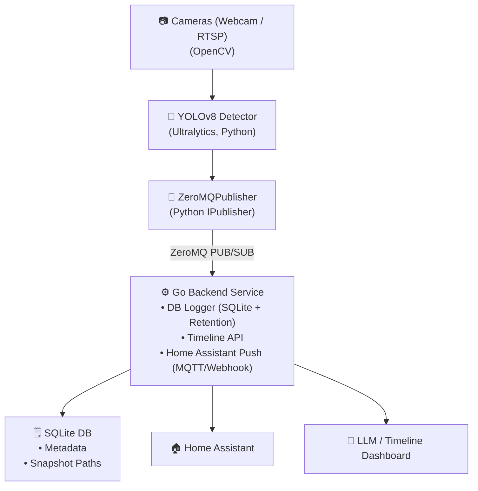

# 📸 chat-with-my-camera
 


🚧 **This project is under progress!** 🚧


A modular real-time object detection pipeline for Linux boxes, Raspberry Pi, or Jetson — built to run YOLOv8 and talk to you about what it sees. 

## Features
- Modular camera source (webcam now, RTSP next!)
- YOLOv8 inference with PyTorch/Ultralytics
- Real-time bounding boxes drawn on live video
- ZeroMQ publisher planned for detection events
- Future: integrate local LLM (Ollama) to chat with your detection logs


## Current Pipeline

- **Camera Source:** Local webcam
- **Detector:** YOLOv8 (via `ultralytics` Python package)
- **Publisher:** ZeroMQ publisher (implements `IPublisher`)
- **Subscriber:** ZeroMQ subscriber (implements `ISubscriber`)
  - Throttling and deduplication configurable

## Multi-Camera Grid View

Now supports **multiple camera feeds** with a **dynamic grid view**:

- Supports any mix of webcams and RTSP streams  
- Automatically resizes all feeds to the same dimensions  
- Arranges feeds in a neat grid: 1x1, 2x2, 3x3, 4x4... auto-adjusts as you add cameras  
- Each detection includes a camera ID so you know *which feed saw what*  
- Publishes detection events over ZeroMQ for your LLM or dashboard to consume


---



---

## Directory Structure
```
chat-with-my-camera/                # Root of your project
├── config/                         #  Configuration files (env vars, secrets, YAMLs)
│
├── backend/                        # Go backend service
│   ├── main.go                     # Main entry point: starts ZeroMQ subscriber & HTTP REST server
│   ├── db.go                       #  SQLite DB connection, schema migration, CRUD
│   ├── retention.go                # Data retention: rolling window logic (e.g. delete older than 5 days)
│   ├── publisher.go                # Publishes events to MQTT broker or Home Assistant webhook
│   ├── handlers.go                 # REST API endpoints: /timeline, /health, etc.
│   ├── go.mod                      # Go module declaration (module name, dependencies)
│   ├── go.sum                      # Go dependency checksums (auto-generated)
│   ├── config.yaml                 # Backend config: DB path, server port, retention window
│
├── camera/                         # Python camera modules (OpenCV capture, etc.)
│
├── detection/                      # YOLOv8 Python detection logic
│
├── publisher/                      # ZeroMQ publisher/subscriber interfaces
│
├── utils/                          # Shared Python utility functions
│
├── README.md                       # Project overview & updated backend flowchart
│
├── requirements.txt                # Python dependencies (pinned versions)
│
├── IDEAS.md                        # Brain dump: future features, notes, todos
│
├── LICENSE                         # Project license
│
├── main.py                         # Python entry point: camera + detection + ZeroMQ publisher
│
├── publisher                       # Appears duplicate? Maybe leftover — check this
│
├── utils                           # Same: maybe redundant with `utils/` dir? Clean up if needed
│
├── venv/                           # Python virtual environment directory
│
├── yolov8n.pt                      # YOLOv8 nano model weights file
│
└── zmq_subscriber_example.py       # Example: ZeroMQ subscriber in Python for testing

```

### Quick Start
```bash
# Create and activate a venv
python -m venv venv
source venv/bin/activate

# Install dependencies
pip install -r requirements.txt

# Run it!
python main.py             # Starts detection + publisher
python zmq_subscriber.py   # Receives detection events
```

## Reusable Pub/Sub
This project includes a modular ZeroMQ pub/sub interface:
- `IPublisher` and `ISubscriber` as base interfaces
- `ZeroMQPublisher` and `ZeroMQSubscriber` implementations

```
+-------------------+             +-------------------+
|   IPublisher      |             |   ISubscriber     |
+-------------------+             +-------------------+
         |                                 |
         | implements                      | implements
         ↓                                 ↓
+----------------------+        +----------------------+
|  ZeroMQPublisher     |        |  ZeroMQSubscriber    |
+----------------------+        +----------------------+
| - bind("tcp://*")    |        | - connect("tcp://")  |
| - publish(data)      |        | - subscribe()        |
+----------------------+        +----------------------+

```

## Example config
```yaml
cameras:
  - id: "garage_webcam"
    type: webcam
    index: 0

  - id: "driveway_rtsp"
    type: rtsp
    url: "rtsps://192.168.10.176:7441/..."
```

## Example event JSON
Each detection event includes:
```json
{
  "timestamp": 1720518700.123,
  "camera_id": "driveway_rtsp",
  "labels": ["person", "car"],
  "boxes": [...]
}
```


## 🗺️ Roadmap
See [IDEAS.md](IDEAS.md) for current and future plans.


---

Built with ❤️ - keep watching!