```mermaid
flowchart TD
    A["📷 Webcam Source<br/>(OpenCV)"] --> B["🦁 YOLOv8 Detector<br/>(Ultralytics)"]
    B --> C["📡 ZeroMQPublisher<br/>(IPublisher)"]
    C -->|"ZeroMQ PUB/SUB"| D["🔔 ZeroMQSubscriber<br/>(ISubscriber)"]
    D --> E["🗒️ Print Labels & Boxes<br/>(Throttled + Deduped)"]
```

# 📸 chat-with-my-camera
 

[](https://github.com/Mrunmoy/chat-with-my-camera/tree/main)
[](https://github.com/Mrunmoy/chat-with-my-camera/tree/dev/go-backend)


🚧 **This project is under progress!** 🚧


A modular real-time object detection pipeline for Linux boxes, Raspberry Pi, or Jetson — built to run YOLOv8 and talk to you about what it sees. 

## Branches

- [**main**](https://github.com/Mrunmoy/chat-with-my-camera/tree/main)  
   - Stable YOLO detection, ZeroMQ pub/sub, JSONL logger.
- [**go-backend**](https://github.com/Mrunmoy/chat-with-my-camera/tree/dev/go-backend) 
  - Experimental backend service in Go
  - SQLite storage + retention
  - Local API for timeline queries
  - MQTT or webhook publishing for Home Assistant.


## Features
- Modular camera source (webcam now, RTSP next!)
- YOLOv8 inference with PyTorch/Ultralytics
- Real-time bounding boxes drawn on live video
- ZeroMQ publisher planned for detection events
- Future: integrate local LLM (Ollama) to chat with your detection logs


## Current Pipeline

- **Camera Source:** Local webcam
- **Detector:** YOLOv8 (via `ultralytics` Python package)
- **Publisher:** ZeroMQ publisher (implements `IPublisher`)
- **Subscriber:** ZeroMQ subscriber (implements `ISubscriber`)
  - Throttling and deduplication configurable

## Multi-Camera Grid View

Now supports **multiple camera feeds** with a **dynamic grid view**:

- Supports any mix of webcams and RTSP streams  
- Automatically resizes all feeds to the same dimensions  
- Arranges feeds in a neat grid: 1x1, 2x2, 3x3, 4x4... auto-adjusts as you add cameras  
- Each detection includes a camera ID so you know *which feed saw what*  
- Publishes detection events over ZeroMQ for your LLM or dashboard to consume


---



---

### Quick Start
```bash
# Create and activate a venv
python -m venv venv
source venv/bin/activate

# Install dependencies
pip install -r requirements.txt

# Run it!
python main.py             # Starts detection + publisher
python zmq_subscriber.py   # Receives detection events
```

## Reusable Pub/Sub
This project includes a modular ZeroMQ pub/sub interface:
- `IPublisher` and `ISubscriber` as base interfaces
- `ZeroMQPublisher` and `ZeroMQSubscriber` implementations

```
+-------------------+             +-------------------+
|   IPublisher      |             |   ISubscriber     |
+-------------------+             +-------------------+
         |                                 |
         | implements                      | implements
         ↓                                 ↓
+----------------------+        +----------------------+
|  ZeroMQPublisher     |        |  ZeroMQSubscriber    |
+----------------------+        +----------------------+
| - bind("tcp://*")    |        | - connect("tcp://")  |
| - publish(data)      |        | - subscribe()        |
+----------------------+        +----------------------+

```

## Example config
```yaml
cameras:
  - id: "garage_webcam"
    type: webcam
    index: 0

  - id: "driveway_rtsp"
    type: rtsp
    url: "rtsps://192.168.10.176:7441/..."
```

## Example event JSON
Each detection event includes:
```json
{
  "timestamp": 1720518700.123,
  "camera_id": "driveway_rtsp",
  "labels": ["person", "car"],
  "boxes": [...]
}
```


## 🗺️ Roadmap
See [IDEAS.md](IDEAS.md) for current and future plans.


---

Built with ❤️ - keep watching!