# 📸 chat-with-my-camera
 


🚧 **This project is under progress!** 🚧


A modular real-time object detection pipeline for Linux boxes, Raspberry Pi, or Jetson — built to run YOLOv8 and talk to you about what it sees. 

## Features
- Modular camera source (webcam now, RTSP next!)
- YOLOv8 inference with PyTorch/Ultralytics
- Real-time bounding boxes drawn on live video
- ZeroMQ publisher planned for detection events
- Future: integrate local LLM (Ollama) to chat with your detection logs

### Current Pipeline

- **Camera Source:** Local webcam
- **Detector:** YOLOv8 (via `ultralytics` Python package)
- **Publisher:** ZeroMQ publisher (implements `IPublisher`)
- **Subscriber:** ZeroMQ subscriber (implements `ISubscriber`)
  - Throttling and deduplication configurable

```mermaid
flowchart TD
    A["📷 Webcam Source<br/>(OpenCV)"] --> B["🦁 YOLOv8 Detector<br/>(Ultralytics)"]
    B --> C["📡 ZeroMQPublisher<br/>(IPublisher)"]
    C -->|"ZeroMQ PUB/SUB"| D["🔔 ZeroMQSubscriber<br/>(ISubscriber)"]
    D --> E["🗒️ Print Labels & Boxes<br/>(Throttled + Deduped)"]
```




---

### Quick Start
```bash
# Create and activate a venv
python -m venv venv
source venv/bin/activate

# Install dependencies
pip install -r requirements.txt

# Run it!
python main.py             # Starts detection + publisher
python zmq_subscriber.py   # Receives detection events
```

## Reusable Pub/Sub
This project includes a modular ZeroMQ pub/sub interface:
- `IPublisher` and `ISubscriber` as base interfaces
- `ZeroMQPublisher` and `ZeroMQSubscriber` implementations

```
+-------------------+             +-------------------+
|   IPublisher      |             |   ISubscriber     |
+-------------------+             +-------------------+
         |                                 |
         | implements                      | implements
         ↓                                 ↓
+----------------------+        +----------------------+
|  ZeroMQPublisher     |        |  ZeroMQSubscriber    |
+----------------------+        +----------------------+
| - bind("tcp://*")    |        | - connect("tcp://")  |
| - publish(data)      |        | - subscribe()        |
+----------------------+        +----------------------+

```

## 🗺️ Roadmap
See [IDEAS.md](IDEAS.md) for current and future plans.


---

Built with ❤️ by Mrunmoy — keep watching!