# 📸 Chat with camera


**A modular, real-time object detection system for your local network - with YOLOv8, ZeroMQ pub/sub, timeline storage, and a local LLM that lets you *****talk***** to your cameras.** 
It is in no way perfect and is basically a sandbox for experimenting with different technologies and programming languages and see how we can integrate them together to make something so much fun!

I had a webcam lying around and a few Unifi flex cameras, so I just used them to see if I can make something that can do smart detections and integrate with LLM to answer some questions. Well to my pleasant surprise, working on this project was way more fun than I expected it to be. I was super scared but at least made it to this point here. Hope you have fun.

- Fully local — no cloud fees
- Modular pub/sub -> easy to swap parts
- Explainable AI -> no hallucinated answers, only real detections
- Can possibly work on your Pi, Jetson

---

## Key Features

- YOLOv8 detection (Python)
- Webcam & RTSP support (OpenCV)
- ZeroMQ pub/sub decoupled pipeline
- Go backend: SQLite timeline, snapshot API, retention cleanup
- React frontend: multi-camera grid, single-camera view, timeline, chat
- Local LLM (Ollama): smart prompt extraction -> timeline lookup -> natural answers

---

## Architecture Overview

```mermaid
flowchart TD
    A["Cameras (Webcam / RTSP)<br/>(Python OpenCV)"]
    --> B["YOLOv8 Detector<br/>(Ultralytics, Python)"]
    B --> C["ZeroMQ Publisher"]
    C -->|"PUB/SUB"| D["Go Backend<br/>• SQLite Timeline<br/>• Retention<br/>• Snapshots API"]
    D --> E["SQLite DB"]
    D --> F["Local LLM<br/>(Ollama)"]
    D --> G["React Frontend<br/>• Dashboard<br/>• Timeline<br/>• Chat"]
```



---

## Repo Layout

```
chat-with-my-camera/
├── config/           # YAML/Env config
├── backend/          # Go API: timeline, retention, LLM chat
├── frontend/         # React app: grid, detail, chat
├── camera/           # Python webcam modules
├── detection/        # YOLOv8 inference logic
├── publisher/        # ZeroMQ pub/sub
├── snapshots/        # Stored images for timeline
├── utils/            # Shared helpers
├── main.py           # Python entry: camera + detection
├── IDEAS.md          # Rolling roadmap
└── README.md         # This file (overview)
```

---

## How it Works

- Python runs cameras + YOLOv8 -> publishes detections via ZeroMQ.
- Go backend subscribes -> logs detections in SQLite -> stores snapshots -> serves `/timeline` & `/snapshots`.
- Frontend shows grid + timeline -> lets you chat with the LLM:
*“When did you last see a delivery van?”* ->
LLM extracts object -> backend queries timeline -> LLM returns real context answer.

---

## Quick Start

**Python detector + publisher:**

```bash
python3 -m venv venv && source venv/bin/activate
pip install -r requirements.txt
python main.py
```

**Go Backend:**

```bash
cd backend
go run main.go
```

**React Frontend:**

```bash
cd frontend
npm install
npm run dev
```

**Local LLM (Ollama):**

```bash
ollama serve  # Run Ollama on localhost:11434
ollama pull llama3
```

---


Each piece has its own README:

- [`backend/README.md`](./backend/README.md)  — API, timeline, retention, LLM chat loop
- [`frontend/README.md`](./frontend/README.md)  — dashboard structure, components, styles
- [`python/README.md`](./python/README.md)  — detection loop, pub/sub config
- [`llm/README.md`](./llm/README.md)  — local Ollama usage, prompt examples

## Next Steps

See [`IDEAS.md`](./IDEAS.md) for what’s next.

---

## License

MIT
